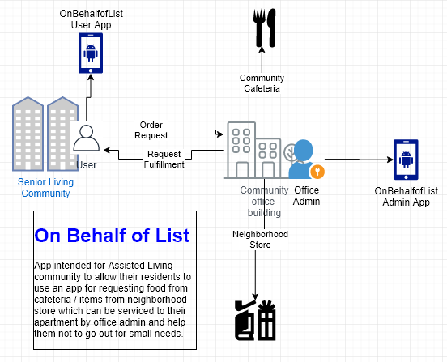

# OnBehalfofList
App intended for Assisted Living community to allow their residents to use an app for requesting food from cafeteria / items from neighborhood store which can be serviced to their apartment by office admin and help them not to go out for small needs.
### Block diagram

### Technology
- Flutter + Dart
- Firebase; Firestore Native Database
- Brother P-Touch editor for label printer templates
- Flutter plug-ins like Brother Label Printer, QR code creator and scanner
